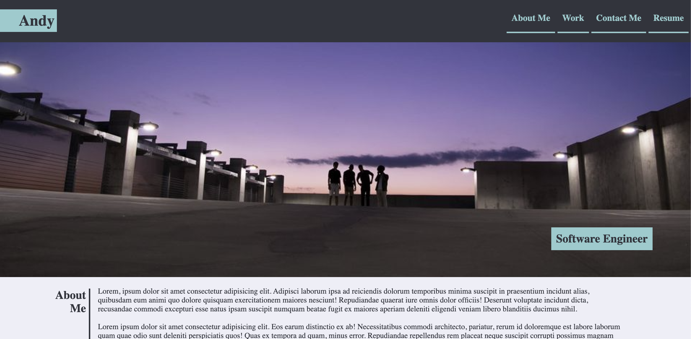
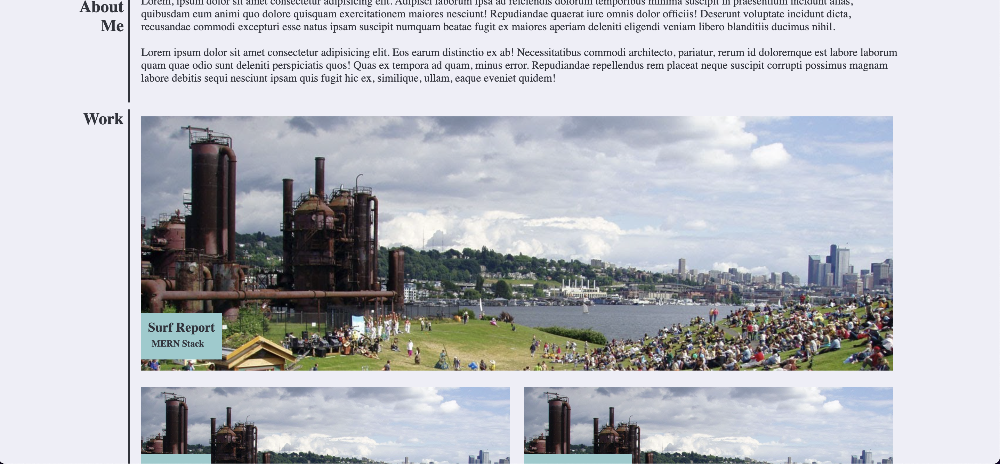
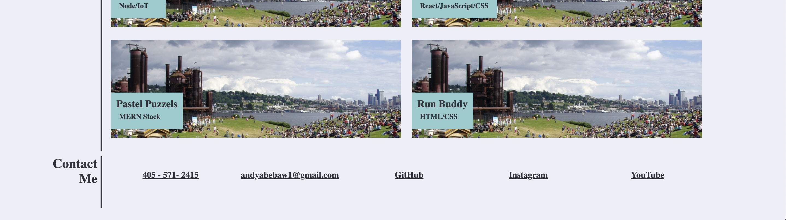

# Week Two Challenge

## Github Pages
 https://andyabebaw.github.io/Challenge2Portfolio/
 
## Description

This website was built to serve as a portfolio website for my future projects.  It has a header with links that work as a table of contents for the webpage where when clicked it skips to the selected links corresponding section on the page.  It also has a cover photo image of me and some of my friends to show who the page is about and title of software engineer on top.  Below that there is a section for projects that we will work on in the future.  Since I have not yet done any projects I used the same image for all the project sections to work as a temporary filler. Below that is a contact me section with links that are supposed to link to my contact details such as email github etc but I currently have it set to link back to the page.

## Table of Contents (Optional)

- [Installation](#installation)
- [Usage](#usage)
- [Features](#features)

## Installation

1. Go To https://github.com/andyabebaw/Challenge2
2. Copy the Git clone link using SSH.
3. In terminal on your local device, clone the repository using Git clone.
4. Open in Visual Studio.

## Usage

This site can be used to learn about more about me, my projects Ive worked on, and contact information for how to reach me.  The page has interactive links and images to show more about what is being discuessed.

## Features

- Clickable links in header
- About Me section
- Featured Projects section
- Contact Me Section with links
- Detailed Images
- Header Section for navigation links and page title

## How to Contribute

Follow the Installation Instructions above or click here: [Installation](#installation)
Make changes to index.html to add, remove, or change sections.  Edit the style.css to change the website appearance.  Also free to add new images in the images in images folder to be used on the site.
